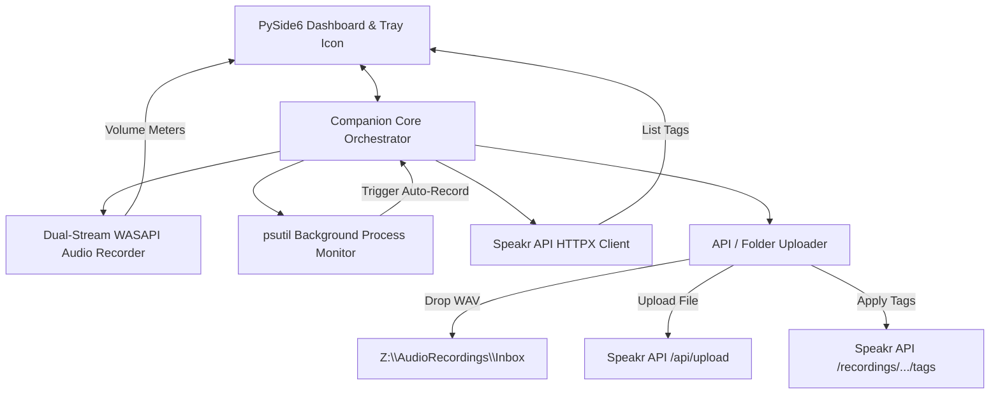

# Speakr Windows Companion App Design Plan

## 1. Overview
The Speakr Windows Companion App is a background desktop utility that automates and manages audio capture on Windows. It records meeting audio (both microphone and system loopback) without requiring active window focus, provides real-time volume indicators, manages metadata (tags) before and during sessions, and drops recordings into either Speakr's auto-process Syncthing directory (`Z:\AudioRecordings\Inbox`) or directly via the Speakr REST API.
- **GitHub Repository:** [sandersoncw55/speakr-companion](https://github.com/sandersoncw55/speakr-companion)

---

## 2. Core Features & Architecture

### 2.1 PySide6 GUI Dashboard & Dynamic Tray
- **System Tray Integration with Badges:** App runs in the tray with dynamic status indicator dots:
  - 🟢 **Green:** Ready / Idle / Monitoring
  - 🔴 **Red:** Recording active (with live timer in tooltip)
  - 🟡 **Yellow:** Recording paused
  - 🟠 **Orange:** Cooldown active
- **Live Recording Duration Timer:** Real-time timer (`HH:MM:SS`) in the dashboard status card, status bar, and tray tooltip while recording is active.
- **Context-Aware Level Meters:** Volume meters display descriptive statuses (`Idle (Listening...)`, `Idle (Silent)`) when devices are quiet rather than "Mute".
- **Post-Stop Cooldown Delay (1 Minute):** 60-second cooldown timer prevents accidental double-clicking of the stop button and rapid auto-retrigger loops (with manual skip option).
- **Tag Selector Widget:** Active meeting tags are fetched dynamically via the `/tags` REST endpoint. Users can select relevant tags before recording or tag meetings in real-time.
- **Recordings History Tab:** Full library of local recordings with duration, size, trigger type, upload status, one-click Re-Upload, and file playback.
- **Preferences:** Upload preference selectors (Speakr API vs. NAS Folder), local storage path picker, retention policy selector (e.g. 30 days), and auto-record trigger switches.

### 2.2 Dual-Stream WASAPI Audio Recorder (`pyaudiowpatch`)
- **System Loopback Capture:** WASAPI Loopback on the default speaker device captures output audio from applications like Citrix, Zoom, or Teams even when they are running in the background or minimized.
- **Microphone Capture:** Dedicated MME/WASAPI thread captures input from the default or selected microphone.
- **Threaded Recording:** Two separate background threads pull audio data concurrently to prevent drift. A third thread mixes the channels, downsamples and sums the audio to mono, and writes it to an MP4 (AAC @ 64 kbps) or WAV PCM file at 16kHz mono.
- **Non-Destructive Ingestion:** Recordings are retained in local persistent storage for the configured retention period (e.g., 30 days) and are **not deleted** after auto-uploading.

### 2.3 Process Activity Monitoring & Auto-Record Triggers
A background thread periodically queries active processes using `psutil`:
- **Zoom:** Detects `CptHost.exe`. Starts recording upon launch and finishes upon termination.
- **Teams:** Detects `Teams.exe` or `ms-teams.exe`.
- **Citrix Viewer & Workspace:** Detects Citrix processes (`wfica32.exe`, `Citrix.DesktopViewer.App.exe`, `Receiver.exe`, `wfcrun32.exe`, `CitrixWorkspace.exe`, `MsTeamsVdi.exe`, etc.) and performs **audio-gated meeting detection** using Windows Core Audio session metering (`pycaw` / `IAudioMeterInformation`):
  - **Audio-Gating & Debounce:** Continuous audio output metering in the background. Auto-recording triggers only after meeting audio consistently exceeds **−48 dB for at least 2.0 seconds** (preventing spurious starts on alert sounds or idling desktops).
  - **Silence Tolerance:** Tolerates up to **5 minutes (300 seconds) of continuous silence** during a Citrix session before stopping recording and returning to idle audio-gated monitoring.
  - **Post-Record Discard Filter:** Discards recordings post-stop if total accumulated active audio (> −48 dB) is **< 30 seconds**, preventing junk files from short notifications or accidental sounds.
  - **Capture Mix:** Leverages the standard global system loopback + microphone mix for capture.

### 2.4 Live Closed Captions Integration (Windows 11 Native)
- **Windows Live Captions Shortcut & Launch Card:** Provides integrated dashboard guidance and one-click launch for Windows 11's built-in, hardware-accelerated Live Captions (<kbd>Win</kbd> + <kbd>Ctrl</kbd> + <kbd>L</kbd>).
- **Zero Overhead:** Eliminates local ASR model loading and CPU overhead by delegating real-time system subtitling directly to Windows Core Accessibility APIs.

### 2.5 Packaging & Distribution Architecture
- **Dual-Stream Distribution Model:**
  - **Standard Setup Wizard (`.exe` via Inno Setup 6):** User-level installation targeting `%LOCALAPPDATA%\Programs\Speakr Companion` requiring zero UAC / admin elevation. Creates Start Menu and Desktop shortcuts, registers an optional `{userstartup}` auto-launch hook, and provisions a clean Windows uninstaller.
  - **Portable Release (`.zip`):** Self-contained archive with bundled `SpeakrCompanion.exe`, app icon, and quick-start guide for non-installer workflows.
- **Automated Release Pipeline (`package_release.ps1`):** Orchestrates pre-build test validation, background process termination, PyInstaller binary compilation, portable ZIP generation, and Inno Setup compilation in a single command.

---

## 3. Ingestion & Tagging Pipeline

To keep the NAS folder upload compatible with tagging, we implement two paths in the uploader:

### Path A: Direct API Upload (Recommended)
1. App completes the recording and saves a local `.wav` file.
2. The file is uploaded to `POST /api/upload` via `httpx`.
3. The server returns the `recording_id`.
4. If tags are selected in the UI, the app immediately posts those tags to `POST /api/v1/recordings/{recording_id}/tags`.

### Path B: NAS Folder Copy (Syncthing)
1. App completes the recording and copies the file to the Syncthing directory `Z:\AudioRecordings\Inbox\Meeting_[Timestamp].wav`.
2. The Speakr server picks up the file from the share and processes it.
3. If tags are selected in the UI, the companion app spawns a polling thread that queries `GET /api/v1/recordings` every 30 seconds, looking for a recording matching the filename/title.
4. Once the server registers the recording, the app calls `POST /api/v1/recordings/{recording_id}/tags` to apply the tags.

---

## 4. Connections & Related Entities
- **Systems:** [[speakr]], [[whisper-mlx]]
- **Protocols:** [[multi-device-syncthing-setup]]
- **Integration:** [[speakr-whisper-mlx-pipeline]]
